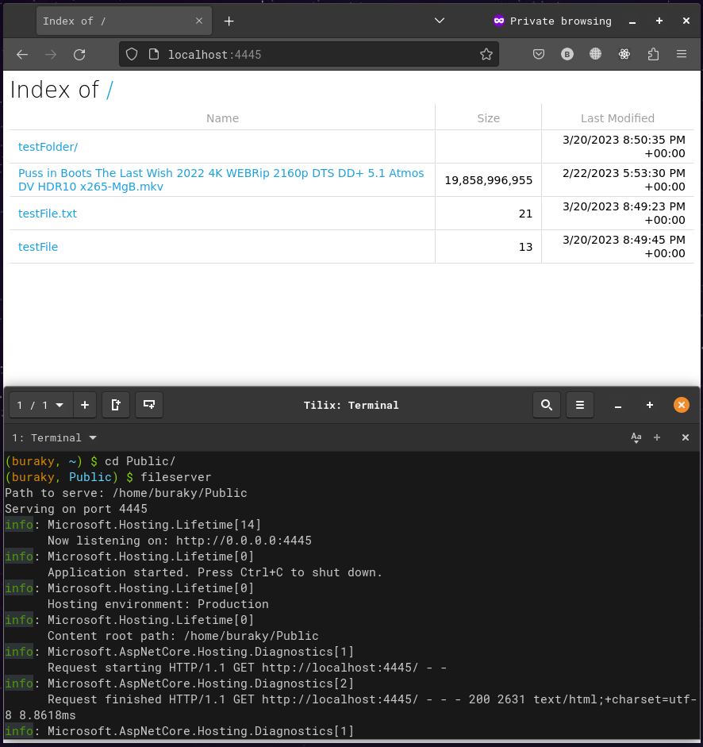
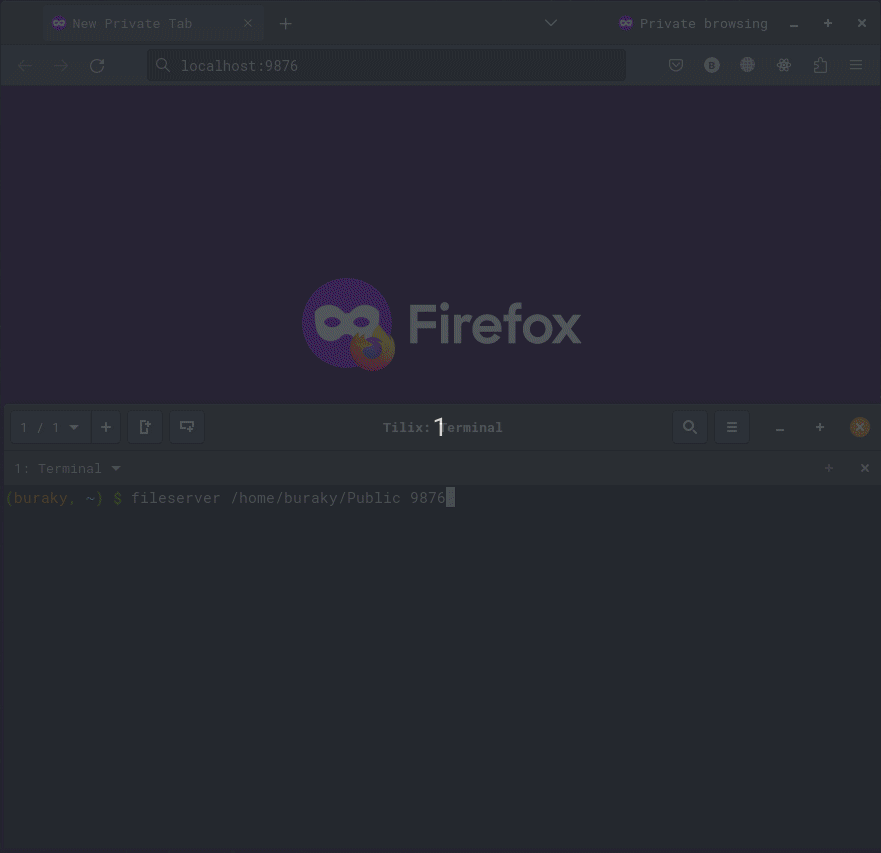

# FileServer

FileServer is a free, open-source CLI app that allows you serve your files over HTTP, even without an internet connection (only on LAN in this case).


## How It Works

FileServer acts as a server and serves your files over HTTP. Everything becomes a web link so this allows clients to browse/view/download the content with just a browser, without installing anything, or any program that can consume web links (curl, wget etc.).

It doesn't have any IP restriction, it listens to all IP adresses on the specified port.


## How To Use

```bash
fileserver [<absolute-path-to-serve> [<port>]]
```

Path and port arguments are optional. By default they are __current working directory__ and __4445__. If wanted to be set with command, first arg is path (second arg is still optional) and then second arg is port. Port can't be set without path arg.

Here are a picture and a gif demonstrating the usage:



